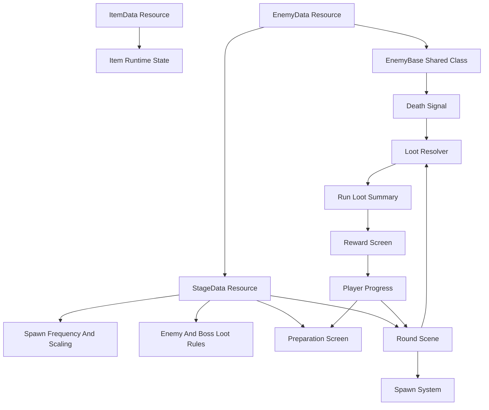
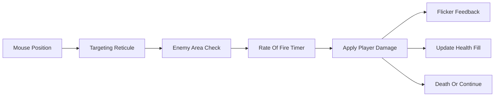

# Godot Node Buster Prototype Plan

## Scope

Build the first playable prototype in Godot 4.6.2 using basic shapes for all entities, projectiles, particles, UI placeholders, and effects. The prototype should prioritize gameplay loops, data definitions, balancing hooks, and testable systems over art.

The repository currently has no Godot project files, so implementation starts by creating a new Godot project structure.

## Project Foundation

- Create `[project.godot](project.godot)` configured for Godot 4.6.2.
- Use a fixed internal gameplay resolution of `480x270`.
- Configure stretch settings so `480x270` is `1x`, `960x540` is `2x`, and `1920x1080` is `4x`.
- Use Godot's project stretch settings for integer scaling and letterboxing instead of manually scaling root nodes.
- Keep fractional viewport scales disabled so placeholder shapes and future pixel art remain crisp.
- Keep art-independent gameplay units aligned with the internal resolution.
- Use gameplay-friendly placeholder nodes such as `Node2D`, `Area2D`, `CollisionShape2D`, `Polygon2D`, and generated `Sprite2D` textures for entities, projectiles, and particles.
- Use `Control` nodes such as `ColorRect` primarily for UI, not world-space gameplay entities.

Proposed folders:

- `[scenes/](scenes/)` for screens and gameplay scenes.
- `[scripts/](scripts/)` for shared gameplay systems.
- `[resources/](resources/)` for `.tres` data-driven item, enemy, stage, and loot definitions.
- `[tests/](tests/)` for automated tests.
- `[autoload/](autoload/)` for narrow global services such as save data, player progress, and registries.
- `[addons/](addons/)` for gdUnit4 and other editor/runtime addons.

## Core Architecture

Use Resource-based data definitions with shared runtime classes.

Architecture guardrails:

- Use typed `class_name` scripts for custom Resources and important runtime services so exported fields are editor-friendly.
- Prefer exported Resource references in `.tres` files over string lookups where designers will author data in the inspector.
- Keep stable string ids on data Resources for saves, tests, analytics, and registry lookups.
- Keep autoloads narrow. They can own persistent progress, registries, and scene flow, but should not hold references to live gameplay nodes.
- Keep active run state scene-owned. Pass a run summary from Round to Reward instead of storing round loot in a global singleton.
- Validate data with pure `validate()`-style methods and gdUnit4 tests rather than relying on scene startup failures.

## Data-Driven Items

Create a shared item system:

- `[resources/items/item_data.gd](resources/items/item_data.gd)` defines item metadata, collection effects, equip effects, leveling curve, max level, and drop tags.
- `[resources/items/item_level_curve.gd](resources/items/item_level_curve.gd)` defines how collected counts map to item levels.
- `[resources/items/item_effect.gd](resources/items/item_effect.gd)` defines reusable item powers and stat modifiers.
- `[scripts/items/item_instance.gd](scripts/items/item_instance.gd)` tracks collected count, level, equipped state, and derived stat values.
- `[autoload/player_progress.gd](autoload/player_progress.gd)` stores persistent collected/uncollected item state and stage progress.
- Runtime item state for the active screen or round should be copied into plain objects or scene-owned state instead of mutating shared `ItemData` resources.

Resource rule:

- Treat item, enemy, stage, loot, level curve, and effect resources as definitions.
- Do not store per-run mutable state directly on shared Resource assets.
- Runtime state belongs in scene nodes, lightweight runtime objects, or save/progress data.
- Duplicate or wrap Resource definitions before adding any run-specific state.

Item requirements:

- Each item has permanent collection effects that apply whenever collected.
- Each item has equipped effects that only apply while equipped.
- Simple starter items can express these as stat modifiers.
- Unique items can express these as custom effect resources, such as chaining projectiles, on-hit effects, kill triggers, area effects, or other powers not yet designed.
- Items are toggle-equipped on the Preparation screen.
- Equip cap starts at `3` before Stage 1 is completed.
- Equip cap should come from stage progress, not a hardcoded UI rule.
- Each item has a configurable max level.
- Default level thresholds are per-level additional drops: level 1 requires `1` drop, level 2 requires `2` additional drops, level 3 requires `4` additional drops, level 4 requires `8` additional drops, and so on.
- Support custom level scaling curves per item. Curves may be linear, exponential, hand-authored thresholds, formula-based, or otherwise non-linear.

Example resource fields to plan for:

- `id`
- `display_name`
- `description`
- `tier`
- `rarity`
- `max_level`
- `level_curve`
- `custom_level_thresholds`
- `permanent_effects`
- `equipped_effects`
- `drop_tags`

Level curve behavior:

- Default curve uses per-level additional drop requirements: `1`, `2`, `4`, `8`, `16`, and so on.
- Custom threshold curves can define exact additional drops required for each level.
- Formula curves can calculate requirements from level number for non-linear progression through typed Resource subclasses, not string-evaluated expressions.
- Flat curves can support items that level every `+1` collected item.
- Curves should expose pure methods such as `get_level_for_count(count)` and `get_progress_to_next_level(count)` so UI and tests use the same rules.

Effect behavior:

- Effects should be Resource-based definitions with runtime application handled by item/stat/effect systems.
- Common effects can be stat modifiers, such as damage, max energy, square reticule size, spawn frequency, rarity weight, quantity, or boss loot chance.
- Unique effects are invoked through a scene-owned effect runner or event bus for gameplay events, such as `on_attack`, `on_hit`, `on_enemy_killed`, `on_boss_killed`, `on_drop_resolved`, or `on_round_tick`.
- Effect Resources should not directly connect themselves to scene signals because the same Resource asset may be shared by many item instances.
- The first implementation should include a generic extension point for unique powers, even if Stage 1 starter items only use stat modifiers.
- Chaining projectiles should be treated as a future custom equipped effect, not as a special case in the base item class.

Item classification:

- `tier` is one of `1`, `2`, `3`, or `4`.
- `rarity` is one of `common`, `rare`, `epic`, or `legendary`.
- Tier and rarity should both be available to loot tables, UI filters, tooltip display, and future balancing rules.
- Item effects can modify drop rates through stat modifiers such as `loot_multiplier`, `rarity_weight_bonus`, `tier_weight_bonus`, or item-specific drop weight bonuses.

Stage 1 starter items:

- Tier 1 Common Damage: permanent `+0.1 damage per level`; equipped `+0.2 damage per level`.
- Tier 1 Common Energy: permanent `+1 max energy per level`; equipped `+2 max energy per level`.
- Tier 1 Common Size: permanent `+5% damage reticule square size per level`; equipped `+10% damage reticule square size per level`.
- Tier 1 Common Spawn Rate: permanent `+25% enemy spawn frequency per level`; equipped `+50% enemy spawn frequency per level`.
- Tier 1 Common Boss Loot: permanent `+20% chance for bosses to drop an additional item per level`; equipped an additional `+20% chance per level`.
- Tier 1 Rare Energy on Kill: permanent `+0.05 energy per kill`; equipped `+0.05 energy per kill per level`.
- Tier 1 Rare Rarity: permanent `+20% increased chance for rare-or-higher drops per level`; equipped an additional `+20% increased chance for rare-or-higher drops per level`.
- Tier 1 Rare Quantity: permanent `+10% more item drops per level`; equipped an additional `+10% more item drops per level`.

Starter item pool rules:

- Energy on Kill, Rarity, and Quantity are rare-only Stage 1 items and should not appear in the common pool.
- Stage 1 enemy drops can include all Tier 1 items, with rarity determined by the Stage 1 rarity chances and item bonuses.
- Boss 1 guaranteed common drops use only Tier 1 common items.
- Boss 1 guaranteed rare drop uses the Tier 1 rare pool.

## Data-Driven Enemies And Boss Encounters

Create one shared enemy scene/runtime:

- `[scenes/enemies/enemy.tscn](scenes/enemies/enemy.tscn)` is the shared enemy scene, with `[scripts/enemies/enemy_base.gd](scripts/enemies/enemy_base.gd)` handling movement, health, hover damage, flicker, despawn, and death signals.
- `[resources/enemies/enemy_data.gd](resources/enemies/enemy_data.gd)` defines reusable standard enemy base stats and behavior configuration.

Enemy definitions should remain data-first. Add new enemy types by creating resources, not new scene-specific scripts unless behavior truly requires extension.
Prefer scene composition and data variation over deep inheritance. `EnemyBase` should stay small and shared; specialized behavior can be added later with contained behavior resources, child nodes, or narrowly scoped subclasses only when data is no longer enough.

Enemy stat fields:

- `max_health`
- `regeneration_rate`
- `armor`
- `move_speed`
- `rotation_speed`
- `size`

Stat behavior:

- `max_health` is the base health before stage health scaling.
- `regeneration_rate` restores health over time, capped at scaled max health.
- `armor` is flat damage block applied before damage reaches health.
- `move_speed` controls how quickly the enemy floats across the screen. Spawn systems choose the direction from spawn edge and target path.
- `rotation_speed` controls placeholder square rotation for readable motion.
- `size` controls collision, visual square size, and health fill size.
- Spawn entries may apply health variance when an enemy is instantiated.
- If health variance is used, size can scale from the same factor so larger enemies visually communicate higher health.
- Enemy death should emit a signal containing the enemy instance and its stage spawn entry. A scene-level loot resolver should decide drops, so enemy nodes do not need to know how loot tables work.

Boss encounter rule:

- A boss is an `EnemyData` spawned by a scheduled stage boss entry.
- Bosses use the same `EnemyBase` runtime and the same enemy stat fields.
- Boss status is stage context, not a separate base data type.
- Boss entries always define a custom loot table.
- Boss drop tables can still be affected by player/item loot modifiers unless a boss entry explicitly opts out for a special reward.

Enemy visual requirements:

- Basic square placeholder body.
- Internal vertical health fill where full square is full health and empty bordered square is zero health.
- Flicker feedback when taking damage.
- Spawn off-screen edge.
- Float across screen.
- Despawn when killed or no longer visible within screen bounds, using Godot-friendly helpers such as `VisibleOnScreenNotifier2D` where appropriate.

## Data-Driven Stages

Create `[resources/stages/stage_data.gd](resources/stages/stage_data.gd)` as the source of truth for what a stage contains and how its rewards scale.

Stage data should contain:

- Stage id, display name, and progress gates.
- Player setup overrides or references needed for the stage.
- All enemy types used by the stage.
- All scheduled boss encounter entries used by the stage.
- Spawn frequency per enemy type.
- Optional spawn window per enemy entry.
- Optional health variance range per enemy entry.
- Boss spawn start time and repeat interval.
- Health scaling per normal enemy entry and per boss spawn count.
- Boss loot quantity scaling per boss spawn count.
- Stage-level loot drop chance multiplier.
- Loot tables attached to each enemy entry.
- Loot tables attached to each specific boss entry.

Keep loot ownership explicit: standard enemy drops live on that enemy's stage entry, and boss drops live on that specific boss entry. Base enemy resources describe what the entity is; stage resources describe when it appears, whether it is used as a boss encounter, how it scales in that stage, and what it can drop there.

Suggested stage entry resources:

- `[resources/stages/stage_enemy_entry.gd](resources/stages/stage_enemy_entry.gd)` references an `EnemyData`, spawn frequency, optional spawn window, health scaling, optional health variance range, enemy-specific loot table, and optional loot drop overrides.
- `[resources/stages/stage_boss_entry.gd](resources/stages/stage_boss_entry.gd)` references an `EnemyData`, first spawn time, repeat interval, per-spawn health scaling, per-spawn loot quantity scaling, and boss-specific loot table.
- `[resources/stages/loot_table.gd](resources/stages/loot_table.gd)` defines eligible item drops and item selection weights.

## Player Base Stats

Create player stat definitions that can be aggregated with permanent item stats, equipped item stats, and stage modifiers.

Initial player stats:

- `max_energy`: `10`
- `current_energy`: starts at max energy when a round begins.
- `base_damage`: `0.5`
- `rate_of_fire`: `1 attack per second`.
- `reticule_half_size`: `20 pixels`, creating a square damage area centered on the mouse.
- `energy_drain_per_second`: stage-owned; Stage 1 drains `0.1 energy per second`.
- `energy_cost_per_damage_dealt`: default `1.0`, meaning the player loses energy equal to damage done after armor and excluding overkill damage.
- `energy_on_kill`: starts at `0`, then increases from items.

Energy behavior:

- Stage drain is applied continuously during the round.
- When an enemy takes damage, reduce player energy by the amount of health damage dealt after armor, capped to the enemy's remaining health so overkill damage does not cost energy.
- If energy reaches `0`, round failure or depleted-state behavior can be stubbed until round end conditions are finalized.
- Energy on kill restores energy after enemy death and should respect max energy unless a later item explicitly allows overfill.

## Loot And Stage Runtime Rules

Stage entry rule:

- Stage entries own stage-specific spawn and loot behavior.
- Base enemy resources should not carry stage-specific loot overrides.
- A centralized spawn system reads stage entries and instantiates the shared enemy scene with the selected data.
- A centralized loot resolver reads stage entries, player modifiers, and loot tables when an enemy dies.

Loot behavior:

- Keep loot resolution simple and deterministic in tests by injecting or seeding randomness.
- Roll whether an enemy drops anything from a base enemy drop chance multiplied by the stage loot drop chance multiplier.
- Higher stages can reduce drops by using a lower stage loot drop chance multiplier.
- If a drop succeeds, roll item rarity using base rarity chances plus rarity item bonuses.
- Use the loot table to select an eligible item by weight within the selected rarity.
- Item bonuses can increase the chance that the selected drop upgrades to a rarer item.
- Item bonuses can increase quantity so one successful drop can award multiple items.
- Extra quantity chances above `100%` should convert to guaranteed extra items plus a fractional roll.
- Boss entries always provide their own custom loot table and can still use rarity and quantity item bonuses unless explicitly disabled.

Drop chance behavior:

- Stage 1 basic enemies have a `25%` base chance to drop an item before the stage multiplier.
- Stage 1 starts with a `1.0x` loot drop chance multiplier.
- Later stages should use lower loot drop chance multipliers.
- Rare items have a `2.5%` base rarity chance after a drop succeeds.
- Epic items have a `0.25%` base rarity chance after a drop succeeds.
- Legendary items have a `0.025%` base rarity chance after a drop succeeds.
- Common items use the remaining rarity chance after rare, epic, and legendary chances.
- Rarity item bonuses improve the chance to drop rare-or-higher items.
- Quantity item bonuses improve the chance to drop multiple items from a successful drop.
- Boss Loot item bonuses can add extra boss drops after the boss's guaranteed/custom drop table is resolved.

Stage 1 boss drop behavior:

- Boss 1 has a guaranteed `1` rare item and `5` common items from the Tier 1 pool.
- Boss 1 uses a custom boss loot table.
- Boss 1 quantity scales by `+25%` each time Boss 1 spawns during the stage.
- Boss Loot item bonuses can add extra boss drops after the guaranteed Boss 1 drops are resolved.

Example loot entry fields:

- `item`
- `item_id`
- `base_weight`
- `min_tier`
- `max_tier`
- `rarity`
- `guaranteed`
- `affected_by_rarity_bonus`
- `affected_by_quantity_bonus`
- `affected_by_player_drop_modifiers`

Stage 1 stat definitions:

- Player stats: `max_energy` `10`, `base_damage` `0.5`, Stage 1 `energy_drain_per_second` `0.1`, `rate_of_fire` `1 attack per second`, `reticule_half_size` `20 pixels`, `energy_cost_per_damage_dealt` `1.0`, `energy_on_kill` `0`, `equip_cap_base` `3`.
- Stage 1 roster: one normal enemy entry, Enemy A, and one scheduled boss entry, Boss 1.
- Enemy A stats: `max_health` `0.5`, `regeneration_rate` `0`, `armor` `0`, `move_speed` `5 pixels per second`, `rotation_speed` `45 degrees per second`, `size` `12 pixels`.
- Enemy A spawn window: before Boss 1 spawns.
- Enemy A spawn interval: `1.0`.
- Enemy A health variance on spawn: `80%` to `120%`.
- Enemy A size scaling: multiply base `12 pixel` size by the same spawn variance factor used for health.
- Enemy A stage health scaling: spawned health gains `+0.02 hp` for each elapsed stage second before spawn, then applies the `80%` to `120%` variance.
- Stage 1 boss entry: Boss 1.
- Boss 1 enemy stats: `max_health` `25`, `regeneration_rate` `0`, `armor` `0`, `move_speed` `5 pixels per second`, `rotation_speed` `15 degrees per second`, `size` `100 pixels`.
- Boss 1 first spawn time: `30 seconds`.
- Boss 1 repeat interval: `30 seconds`.
- Boss 1 health scaling: `+10% max health` per Boss 1 spawn in the current stage.
- Boss 1 loot quantity scaling: `+25% quantity` per Boss 1 spawn in the current stage.
- Stage 1 enemy loot drop overrides: none.
- Stage 1 boss custom drop table: guaranteed `1` Tier 1 rare item and `5` Tier 1 common items.
- Stage 1 loot drop chance multiplier: `1.0x`.
- Stage 1 drop tables attached to each enemy entry: Enemy A can drop all Tier 1 items using the decided Stage 1 drop and rarity chances.
- Stage 1 drop tables attached to each specific boss entry: Boss 1 uses its custom guaranteed Tier 1 rare/common drop table.

## Preparation Screen

Create `[scenes/ui/preparation_screen.tscn](scenes/ui/preparation_screen.tscn)` with script `[scripts/ui/preparation_screen.gd](scripts/ui/preparation_screen.gd)`.

Required behavior:

- Display all possible item drops for the selected stage.
- Separate possible drops by normal enemy entries and scheduled boss entries using the selected stage data.
- Display all known item entries, including collected and uncollected items.
- Show collected count and computed level for each item.
- Show tooltip on hover with permanent stats, equipped stats, level, max level, and next level requirement.
- Toggle equipped state on click.
- Prevent equipping above the current equip cap.
- Start round button transitions to gameplay scene.

## Round Scene

Create `[scenes/game/round_scene.tscn](scenes/game/round_scene.tscn)` with script `[scripts/game/round_scene.gd](scripts/game/round_scene.gd)`.

Required behavior:

- Create a scene-owned run context containing selected stage, computed player stats, elapsed time, and run loot summary.
- Spawn enemies from Stage 1 enemy entries using a centralized spawn system and their stage-defined spawn frequency.
- Spawn Enemy A only before Boss 1 appears.
- Apply Enemy A's `80%` to `120%` spawn health variance and scale its size by the same factor.
- Spawn Boss 1 first at `30 seconds`, then every `30 seconds` after that.
- Apply Boss 1's `+10% max health` and `+25% loot quantity` scaling per Boss 1 spawn in the current stage.
- Apply Stage 1 health scaling to spawned normal enemies and boss encounters.
- Apply armor as flat damage block, health regeneration over time, move speed, rotation speed, and size from enemy data.
- Apply the Stage 1 loot drop chance multiplier, rarity item bonuses, and quantity item bonuses in the centralized loot resolver.
- Accumulate resolved drops into scene-owned run loot state instead of immediately mutating persistent inventory.
- Place a square targeting reticule centered on the mouse.
- Use a square reticule collision area to detect all enemies inside the damage area.
- Apply damage to every enemy inside the targeting collision at player `rate_of_fire` and `damage`.
- Show simple placeholder particles/projectiles only if useful for feedback.
- End round transitions to the Reward screen with the run loot summary.

Damage flow:

## Reward Screen

Create `[scenes/ui/reward_screen.tscn](scenes/ui/reward_screen.tscn)` with script `[scripts/ui/reward_screen.gd](scripts/ui/reward_screen.gd)`.

Required behavior:

- Receive a completed run context or reward summary from the Round scene.
- Display all loot collected during the completed stage.
- Group duplicate item drops and show quantity gained per item.
- Show each item's tier, rarity, previous collected count, new collected count, previous level, and new level.
- Highlight items that leveled up from the stage rewards.
- Apply collected loot to `PlayerProgress` when the reward screen is confirmed.
- Return to the Preparation screen after confirmation so the player can review new levels and toggle equipment.
- Handle an empty loot result with a clear empty state.

Reward flow:

## Testing Rules

Adopt sensible automated tests around logic-heavy systems and keep scene tests focused.

Use gdUnit4 as the Godot test framework from the start.

Add tests when:

- A feature changes item collection, per-level drop requirements, custom level curves, level calculation, equip cap rules, item effect application, unique item event hooks, or stat aggregation.
- A feature changes enemy damage, armor, regeneration, health, movement speed, rotation, size, death, despawn, or drop behavior.
- A feature changes player energy drain, damage energy cost, energy on kill, stage data parsing, spawn frequency, health scaling, stage loot drop chance multiplier behavior, rarity bonus behavior, quantity bonus behavior, weighted item selection, run loot accumulation, reward application, drop table display, or preparation screen eligibility rules.
- A bug is fixed in gameplay logic; add a regression test that would have failed before the fix.
- A Resource schema gains derived behavior or validation logic.
- A data validation rule is added for stage entries, loot tables, level curves, or item effects.

Tests do not need to cover:

- Placeholder art node colors or exact visual polish.
- One-off editor layout details unless they affect gameplay behavior.
- Temporary balancing values marked TBD.

Preferred test shape:

- Use unit-style tests for pure logic such as item levels, per-level drop requirements, custom level curves, effect activation rules, equip caps, stat aggregation, armor damage reduction, regeneration ticks, energy drain, damage energy cost, energy on kill, spawn rule calculation, health scaling, stage loot drop chance multiplier application, rarity bonuses, quantity bonuses, weighted item selection, and drop table grouping.
- Use unit-style tests for reward summary logic, duplicate loot grouping, before/after item counts, and level-up detection.
- Use lightweight scene tests for reticule overlap damage, enemy death, and despawn behavior.
- Keep tests deterministic by avoiding real timers where possible; expose tick methods or inject delta/time.
- Prefer testing pure GDScript services/resources directly and only instantiate scenes when node lifecycle, signals, collision areas, or visibility behavior are the thing being tested.
- Each feature PR should include either tests or a short reason tests are not useful yet.

Candidate files:

- `[tests/items/test_item_leveling.gd](tests/items/test_item_leveling.gd)`
- `[tests/items/test_item_level_curves.gd](tests/items/test_item_level_curves.gd)`
- `[tests/items/test_item_effect_hooks.gd](tests/items/test_item_effect_hooks.gd)`
- `[tests/items/test_equipment_cap.gd](tests/items/test_equipment_cap.gd)`
- `[tests/player/test_player_energy.gd](tests/player/test_player_energy.gd)`
- `[tests/enemies/test_enemy_damage.gd](tests/enemies/test_enemy_damage.gd)`
- `[tests/enemies/test_enemy_regeneration.gd](tests/enemies/test_enemy_regeneration.gd)`
- `[tests/loot/test_weighted_drop_table.gd](tests/loot/test_weighted_drop_table.gd)`
- `[tests/loot/test_rarity_and_quantity_bonuses.gd](tests/loot/test_rarity_and_quantity_bonuses.gd)`
- `[tests/rewards/test_reward_summary.gd](tests/rewards/test_reward_summary.gd)`
- `[tests/resources/test_data_validation.gd](tests/resources/test_data_validation.gd)`
- `[tests/stages/test_stage_drop_listing.gd](tests/stages/test_stage_drop_listing.gd)`
- `[tests/stages/test_stage_spawn_and_scaling.gd](tests/stages/test_stage_spawn_and_scaling.gd)`

## Implementation Order

1. Create Godot project settings and folder structure.
2. Add gdUnit4 and the initial test runner setup.
3. Add the minimum Resource classes needed for the first playable loop: player stats, enemies, stages, stage enemy entries, stage boss entries, loot tables, and stat modifiers.
4. Add Stage 1 resources with concrete first-pass player, Enemy A, Boss 1, spawn, health scaling, and placeholder loot values, leaving only undecided balance values marked TBD.
5. Add Round scene, mouse reticule, centralized enemy spawning, hover damage, health display, death signals, basic run result tracking, and despawn.
6. Add the scene flow for a complete gameplay loop: Preparation start button, Round completion/failure, Reward summary placeholder, reward confirmation, and return flow to Preparation.
7. Add item Resource classes, item level curves, item effects, player progress state, and item leveling/equip/effect logic without mutating shared Resource definitions.
8. Expand the Preparation and Reward screens with drop listings, item state, tooltips, equip toggling, and persistent loot application.
9. Replace placeholder loot with Stage 1 starter item and drop table values.
10. Add focused tests for item leveling, equipment cap, stat aggregation, enemy damage, reward summaries, and stage drop listing.

## Acceptance Criteria

- Running the project opens a usable Preparation screen.
- The Preparation screen shows Stage 1 possible drops grouped by normal enemy entries and scheduled boss entries.
- Item lists and tooltips show item tier and rarity.
- The player can toggle up to 3 equipped items before Stage 1 completion.
- Item collection count computes level using per-level additional drop requirements or custom per-item scaling curves.
- Starting a round opens the gameplay scene with a mouse-centered reticule.
- Stage loot is accumulated into a run loot summary during the round.
- Completing a stage opens a Reward screen showing all collected loot before applying it to persistent progress.
- Confirming the Reward screen applies loot to `PlayerProgress` and returns to Preparation.
- The player starts with `10` energy, attacks once per second, has a square reticule with `20 pixel` half-size, Stage 1 drains `0.1` energy per second, and dealing `0.5` base damage reduces energy by non-overkill damage dealt.
- Enemies spawn off-screen from stage-defined spawn frequencies, cross the play area, take hover damage, flicker, show square health fill, and despawn appropriately.
- Normal enemies and boss encounters apply health, regeneration, armor, movement speed, rotation speed, and size from `EnemyData` resources.
- Stage 1 contains Enemy A before Boss 1, then Boss 1 spawns every `30 seconds`.
- Enemy A uses `0.5 hp`, `5 pixels per second` speed, `12 pixel` base size, `80%` to `120%` spawn health variance, size scaled by health variance, and `+0.02 hp every 1 second` stage health scaling.
- Boss 1 uses `25 hp`, `5 pixels per second` speed, `15 degrees per second` rotation speed, `100 pixel` size, `+10% max health` per spawn, and `+25% loot quantity` per spawn.
- Stage entries, not base enemy resources, own loot overrides and drop table data.
- Enemy death emits a signal and loot is resolved by a centralized loot resolver.
- Stage 1 includes starter item resources for Damage, Energy on Kill, Energy, Size, Spawn Rate, Rarity, Quantity, and Boss Loot.
- Item effects support both simple stat modifiers and future unique powers through Resource-backed effect hooks.
- Stage 1 basic enemies use a `25%` base item drop chance and a `1.0x` stage loot drop chance multiplier.
- Stage 1 rarity rolls include base chances for rare, epic, and legendary items.
- Later stages can lower drops by reducing their stage loot drop chance multiplier.
- Item bonuses can improve rare-or-higher results and can increase item quantity from successful drops.
- Stage 1 player, enemy, boss encounter, spawn frequency, boss spawn interval, health scaling, loot quantity scaling, loot drop chance multiplier, weighted drop table, tier, and rarity values have first-pass implementation values.
- gdUnit4 is installed or documented as the selected test framework, with initial tests covering core rules.
- Tests cover the main rules that are likely to regress during future feature work, including level curves and item effect activation rules.

