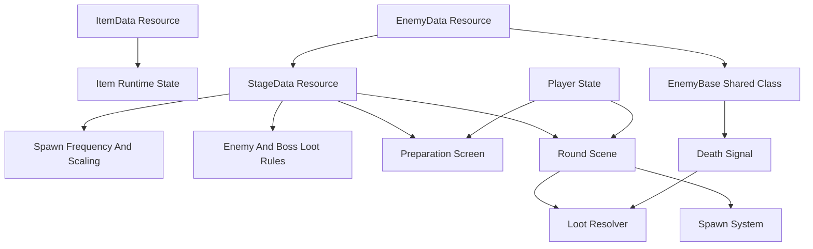
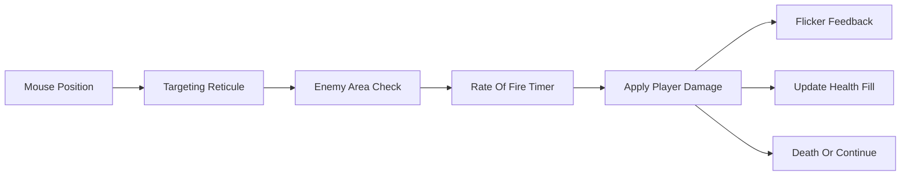

# Godot Node Buster Prototype Plan

## Scope

Build the first playable prototype in Godot 4.6.2 using basic shapes for all entities, projectiles, particles, UI placeholders, and effects. The prototype should prioritize gameplay loops, data definitions, balancing hooks, and testable systems over art.

The repository currently has no Godot project files, so implementation starts by creating a new Godot project structure.

## Project Foundation

- Create `[project.godot](project.godot)` configured for Godot 4.6.2.
- Use a fixed internal gameplay resolution of `480x270`.
- Configure stretch settings so `480x270` is `1x`, `960x540` is `2x`, and `1920x1080` is `4x`.
- Keep art-independent gameplay units aligned with the internal resolution.
- Use gameplay-friendly placeholder nodes such as `Node2D`, `Area2D`, `CollisionShape2D`, `Polygon2D`, and generated `Sprite2D` textures for entities, projectiles, and particles.
- Use `Control` nodes such as `ColorRect` primarily for UI, not world-space gameplay entities.

Proposed folders:

- `[scenes/](scenes/)` for screens and gameplay scenes.
- `[scripts/](scripts/)` for shared gameplay systems.
- `[resources/](resources/)` for `.tres` data-driven item, enemy, stage, and loot definitions.
- `[tests/](tests/)` for automated tests.
- `[autoload/](autoload/)` for narrow global services such as save data, player progress, and registries.

## Core Architecture

Use Resource-based data definitions with shared runtime classes.

## Data-Driven Items

Create a shared item system:

- `[resources/items/item_data.gd](resources/items/item_data.gd)` defines item metadata, stat grants, equip bonus, leveling curve, max level, and drop tags.
- `[scripts/items/item_instance.gd](scripts/items/item_instance.gd)` tracks collected count, level, equipped state, and derived stat values.
- `[autoload/player_progress.gd](autoload/player_progress.gd)` stores persistent collected/uncollected item state and stage progress.
- Runtime item state for the active screen or round should be copied into plain objects or scene-owned state instead of mutating shared `ItemData` resources.

Resource rule:

- Treat item, enemy, boss, stage, and loot resources as definitions.
- Do not store per-run mutable state directly on shared Resource assets.
- Runtime state belongs in scene nodes, lightweight runtime objects, or save/progress data.

Item requirements:

- Each item has one permanent stat increase that applies whenever collected.
- Each item has one equipped bonus that only applies while equipped.
- Items are toggle-equipped on the Preparation screen.
- Equip cap starts at `3` before Stage 1 is completed.
- Equip cap should come from stage progress, not a hardcoded UI rule.
- Each item has a configurable max level.
- Default level thresholds are per-level additional drops: level 1 requires `1` drop, level 2 requires `2` additional drops, level 3 requires `4` additional drops, level 4 requires `8` additional drops, and so on.
- Support custom scaling strategies, such as leveling every `+1` collected item.

Example resource fields to plan for:

- `id`
- `display_name`
- `description`
- `tier`
- `rarity`
- `max_level`
- `level_curve_type`
- `custom_level_thresholds`
- `permanent_stat_modifiers`
- `equipped_stat_modifiers`
- `drop_tags`

Item classification:

- `tier` is one of `1`, `2`, `3`, or `4`.
- `rarity` is one of `common`, `rare`, `epic`, or `legendary`.
- Tier and rarity should both be available to loot tables, UI filters, tooltip display, and future balancing rules.
- Item effects can modify drop rates through stat modifiers such as `loot_multiplier`, `rarity_weight_bonus`, `tier_weight_bonus`, or item-specific drop weight bonuses.

Stage 1 starter items:

- Tier 1 Common Damage: permanent `+0.1 damage per level`; equipped `+0.2 damage per level`.
- Tier 1 Common Energy on Kill: permanent `+0.05 energy per kill`; equipped `+0.05 energy per kill per level`.
- Tier 1 Common Energy: permanent `+1 max energy per level`; equipped `+2 max energy per level`.
- Tier 1 Common Size: permanent `+5% damage reticule radius per level`; equipped `+10% damage reticule radius per level`.
- Tier 1 Common Spawn Rate: permanent `+25% enemy spawn speed per level`; equipped `+50% enemy spawn speed per level`.
- Tier 1 Common Rarity: permanent `+20% increased chance for rare-or-higher drops per level`; equipped an additional `+20% increased chance for rare-or-higher drops per level`.
- Tier 1 Common Quantity: permanent `+10% more item drops per level`; equipped an additional `+10% more item drops per level`.
- Tier 1 Common Boss Loot: permanent `+20% chance for bosses to drop an additional item per level`; equipped an additional `+20% chance per level`.

## Data-Driven Enemies And Boss Encounters

Create one shared enemy runtime class:

- `[scripts/enemies/enemy_base.gd](scripts/enemies/enemy_base.gd)` handles movement, health, hover damage, flicker, despawn, and death signals.
- `[resources/enemies/enemy_data.gd](resources/enemies/enemy_data.gd)` defines reusable standard enemy base stats and behavior configuration.

Enemy definitions should remain data-first. Add new enemy types by creating resources, not new scene-specific scripts unless behavior truly requires extension.
Prefer scene composition and data variation over deep inheritance. `EnemyBase` should stay small and shared; specialized behavior can be added later with contained behavior resources, child nodes, or narrowly scoped subclasses only when data is no longer enough.

Enemy stat fields:

- `max_health`
- `regeneration_rate`
- `armor`
- `velocity`
- `rotation_speed`
- `size`

Stat behavior:

- `max_health` is the base health before stage health scaling.
- `regeneration_rate` restores health over time, capped at scaled max health.
- `armor` is flat damage block applied before damage reaches health.
- `velocity` controls how quickly the enemy floats across the screen.
- `rotation_speed` controls placeholder square rotation for readable motion.
- `size` controls collision, visual square size, and health fill size.
- Spawn entries may apply health variance when an enemy is instantiated.
- If health variance is used, size can scale from the same factor so larger enemies visually communicate higher health.
- Enemy death should emit a signal containing the enemy instance and its stage spawn entry. A scene-level loot resolver should decide drops, so enemy nodes do not need to know how loot tables work.

Boss encounter rule:

- A boss is an `EnemyData` spawned by a fixed-time stage boss entry.
- Bosses use the same `EnemyBase` runtime and the same enemy stat fields.
- Boss status is stage context, not a separate base data type.
- Boss entries always define a custom loot table.
- Boss drop tables can still be affected by player/item loot modifiers unless a boss entry explicitly opts out for a special reward.

Enemy visual requirements:

- Basic square placeholder body.
- Internal vertical health fill where full square is full health and empty bordered square is zero health.
- Flicker feedback when taking damage.
- Spawn off-screen edge.
- Float across screen.
- Despawn when killed or no longer visible within screen bounds, using Godot-friendly helpers such as `VisibleOnScreenNotifier2D` where appropriate.

## Data-Driven Stages

Create `[resources/stages/stage_data.gd](resources/stages/stage_data.gd)` as the source of truth for what a stage contains and how its rewards scale.

Stage data should contain:

- Stage id, display name, and progress gates.
- Player setup overrides or references needed for the stage.
- All enemy types used by the stage.
- All fixed-time boss encounter entries used by the stage.
- Spawn frequency per enemy type.
- Optional spawn window per enemy entry.
- Optional health variance range per enemy entry.
- Boss spawn times.
- Health scaling per normal enemy entry and boss entry.
- Stage-level loot multiplier.
- Loot tables attached to each enemy entry.
- Loot tables attached to each specific boss entry.

Keep loot ownership explicit: standard enemy drops live on that enemy's stage entry, and boss drops live on that specific boss entry. Base enemy resources describe what the entity is; stage resources describe when it appears, whether it is used as a boss encounter, how it scales in that stage, and what it can drop there.

Suggested stage entry resources:

- `[resources/stages/stage_enemy_entry.gd](resources/stages/stage_enemy_entry.gd)` references an `EnemyData`, spawn frequency, optional spawn window, health scaling, optional health variance range, enemy-specific loot table, and optional loot drop overrides.
- `[resources/stages/stage_boss_entry.gd](resources/stages/stage_boss_entry.gd)` references an `EnemyData`, fixed spawn time, health scaling, and boss-specific loot table.
- `[resources/stages/loot_table.gd](resources/stages/loot_table.gd)` defines weighted item drops and can be modified by the stage loot multiplier.

## Player Base Stats

Create player stat definitions that can be aggregated with permanent item stats, equipped item stats, and stage modifiers.

Initial player stats:

- `max_energy`: `10`
- `current_energy`: starts at max energy when a round begins.
- `base_damage`: `0.5`
- `rate_of_fire`: `1 attack per second`.
- `reticule_radius`: `20 pixels`.
- `energy_drain_per_second`: stage-owned; Stage 1 drains `0.1 energy per second`.
- `energy_cost_per_damage_dealt`: default `1.0`, meaning the player loses energy equal to damage done after armor and excluding overkill damage.
- `energy_on_kill`: starts at `0`, then increases from items.

Energy behavior:

- Stage drain is applied continuously during the round.
- When an enemy takes damage, reduce player energy by the amount of health damage dealt after armor, capped to the enemy's remaining health so overkill damage does not cost energy.
- If energy reaches `0`, round failure or depleted-state behavior can be stubbed until round end conditions are finalized.
- Energy on kill restores energy after enemy death and should respect max energy unless a later item explicitly allows overfill.

Stage entry rule:

- Stage entries own stage-specific spawn and loot behavior.
- Base enemy resources should not carry stage-specific loot overrides.
- A centralized spawn system reads stage entries and instantiates the shared enemy scene with the selected data.
- A centralized loot resolver reads stage entries, player modifiers, and loot tables when an enemy dies.

Loot table behavior:

- Use weighted entries rather than fixed percentages.
- Each loot entry references an item and has a base weight.
- Loot entries can optionally constrain or boost by item tier, rarity, enemy type, boss type, or stage.
- Final weight should account for stage loot multiplier and player/item drop-rate modifiers.
- Drop resolution should be deterministic in tests by injecting or seeding randomness.
- Boss entries always provide their own set drop table, even if some entries have low weights.

Drop chance behavior:

- Stage 1 basic enemies have a `25%` base chance to drop an item.
- Rare items have a `2.5%` base drop chance before stage, boss-kill, and item modifiers.
- Epic items have a `0.25%` base drop chance before stage, boss-kill, and item modifiers.
- Legendary base drop chance is TBD.
- Stage 2 should have a lower base drop chance than Stage 1.
- Starting with the first boss kill, and for every enemy killed after that, increase the chance for rare-or-higher items.
- The rare-or-higher chance bonus increases for every boss killed in the current stage.
- The Rarity item further modifies rare-or-higher odds.
- The Quantity item modifies item quantity after a drop succeeds.
- The Boss Loot item can add extra boss drops after the boss's guaranteed/custom drop table is resolved.

Stage 1 boss drop behavior:

- The first boss has a guaranteed `1` item drop.
- First boss drops should use a custom boss loot table.
- Include the Stage 1 boss-focused starter items, such as Rarity, Quantity, and Boss Loot, in the first boss drop pool unless later balance changes split them across bosses.

Example loot entry fields:

- `item_id`
- `base_weight`
- `min_tier`
- `max_tier`
- `rarity`
- `guaranteed`
- `quantity_min`
- `quantity_max`
- `affected_by_loot_multiplier`
- `affected_by_player_drop_modifiers`

Stage 1 stat definitions:

- Player stats: `max_energy` `10`, `base_damage` `0.5`, Stage 1 `energy_drain_per_second` `0.1`, `rate_of_fire` `1 attack per second`, `reticule_radius` `20 pixels`, `energy_cost_per_damage_dealt` `1.0`, `energy_on_kill` `0`, `luck/drop_modifier` TBD, `equip_cap_base` `3`.
- Stage 1 roster: one normal enemy entry, Enemy A, and one fixed-time boss entry, Boss 1.
- Enemy A stats: `max_health` `0.5`, `regeneration_rate` `0`, `armor` `0`, `velocity` `5 pixels per second`, `rotation_speed` TBD, `size` `12 pixels`.
- Enemy A spawn window: before Boss 1 spawns.
- Enemy A spawn frequency: TBD.
- Enemy A health variance on spawn: `80%` to `120%`.
- Enemy A size scaling: multiply base `12 pixel` size by the same spawn variance factor used for health.
- Enemy A stage health scaling: `+0.02 hp every 1 second`.
- Stage 1 boss entry: Boss 1.
- Boss 1 enemy stats: `max_health` `25`, `regeneration_rate` `0`, `armor` `0`, `velocity` `5 pixels per second`, `rotation_speed` TBD, `size` `100 pixels`.
- Boss 1 fixed spawn time: TBD.
- Boss 1 health scaling: none initially unless later tuning adds it.
- Stage 1 enemy loot drop overrides: TBD per stage enemy entry.
- Stage 1 boss fixed spawn times: TBD.
- Stage 1 boss custom drop table: TBD.
- Stage 1 loot multiplier: TBD.
- Stage 1 drop tables attached to each enemy entry: TBD.
- Stage 1 drop tables attached to each specific boss entry: TBD.

## Preparation Screen

Create `[scenes/ui/preparation_screen.tscn](scenes/ui/preparation_screen.tscn)` with script `[scripts/ui/preparation_screen.gd](scripts/ui/preparation_screen.gd)`.

Required behavior:

- Display all possible item drops for the selected stage.
- Separate possible drops by normal enemy entries and fixed-time boss entries using the selected stage data.
- Display all known item entries, including collected and uncollected items.
- Show collected count and computed level for each item.
- Show tooltip on hover with permanent stats, equipped stats, level, max level, and next level requirement.
- Toggle equipped state on click.
- Prevent equipping above the current equip cap.
- Start round button transitions to gameplay scene.

## Round Scene

Create `[scenes/game/round_scene.tscn](scenes/game/round_scene.tscn)` with script `[scripts/game/round_scene.gd](scripts/game/round_scene.gd)`.

Required behavior:

- Spawn enemies from Stage 1 enemy entries using a centralized spawn system and their stage-defined spawn frequency.
- Spawn Enemy A only before Boss 1 appears.
- Apply Enemy A's `80%` to `120%` spawn health variance and scale its size by the same factor.
- Spawn boss encounters from Stage 1 boss entries at their fixed spawn times.
- Apply Stage 1 health scaling to spawned normal enemies and boss encounters.
- Apply armor as flat damage block, health regeneration over time, velocity, rotation speed, and size from enemy/boss data.
- Apply the Stage 1 loot multiplier plus player/item drop-rate modifiers in the centralized loot resolver when resolving normal enemy and boss encounter weighted loot tables.
- Place a targeting reticule centered on the mouse.
- Use a reticule collision area to detect hovered enemies.
- Apply damage to enemies inside the targeting collision at player `rate_of_fire` and `damage`.
- Show simple placeholder particles/projectiles only if useful for feedback.
- End round conditions can be stubbed until Stage 1 rules are decided.

Damage flow:

## Testing Rules

Adopt sensible automated tests around logic-heavy systems and keep scene tests focused.

Use gdUnit4 as the Godot test framework from the start.

Add tests when:

- A feature changes item collection, per-level drop requirements, level calculation, equip cap rules, or stat aggregation.
- A feature changes enemy damage, armor, regeneration, health, velocity, rotation, size, death, despawn, or drop behavior.
- A feature changes player energy drain, damage energy cost, energy on kill, stage data parsing, spawn frequency, health scaling, loot multiplier behavior, weighted drop resolution, drop table display, or preparation screen eligibility rules.
- A bug is fixed in gameplay logic; add a regression test that would have failed before the fix.
- A Resource schema gains derived behavior or validation logic.

Tests do not need to cover:

- Placeholder art node colors or exact visual polish.
- One-off editor layout details unless they affect gameplay behavior.
- Temporary balancing values marked TBD.

Preferred test shape:

- Use unit-style tests for pure logic such as item levels, per-level drop requirements, equip caps, stat aggregation, armor damage reduction, regeneration ticks, energy drain, damage energy cost, energy on kill, spawn rule calculation, health scaling, loot weight calculation, loot multiplier application, player/item drop-rate modifiers, boss-kill rarity bonuses, and drop table grouping.
- Use lightweight scene tests for reticule overlap damage, enemy death, and despawn behavior.
- Keep tests deterministic by avoiding real timers where possible; expose tick methods or inject delta/time.
- Prefer testing pure GDScript services/resources directly and only instantiate scenes when node lifecycle, signals, collision areas, or visibility behavior are the thing being tested.
- Each feature PR should include either tests or a short reason tests are not useful yet.

Candidate files:

- `[tests/items/test_item_leveling.gd](tests/items/test_item_leveling.gd)`
- `[tests/items/test_equipment_cap.gd](tests/items/test_equipment_cap.gd)`
- `[tests/player/test_player_energy.gd](tests/player/test_player_energy.gd)`
- `[tests/enemies/test_enemy_damage.gd](tests/enemies/test_enemy_damage.gd)`
- `[tests/enemies/test_enemy_regeneration.gd](tests/enemies/test_enemy_regeneration.gd)`
- `[tests/loot/test_weighted_drop_table.gd](tests/loot/test_weighted_drop_table.gd)`
- `[tests/loot/test_boss_kill_rarity_bonus.gd](tests/loot/test_boss_kill_rarity_bonus.gd)`
- `[tests/stages/test_stage_drop_listing.gd](tests/stages/test_stage_drop_listing.gd)`
- `[tests/stages/test_stage_spawn_and_scaling.gd](tests/stages/test_stage_spawn_and_scaling.gd)`

## Implementation Order

1. Create Godot project settings and folder structure.
2. Add gdUnit4 and the initial test runner setup.
3. Add Resource classes for items, enemies, stages, stage enemy entries, stage boss entries, loot tables, and stat modifiers.
4. Add player progress state and item leveling/equip logic without mutating shared Resource definitions.
5. Add Preparation screen data display, tooltip, and equip toggling.
6. Add Round scene, mouse reticule, centralized enemy spawning, hover damage, health display, death signals, loot resolver, and despawn.
7. Add Stage 1 placeholder resources with all stats marked TBD.
8. Add focused tests for item leveling, equipment cap, stat aggregation, enemy damage, and stage drop listing.

## Acceptance Criteria

- Running the project opens a usable Preparation screen.
- The Preparation screen shows Stage 1 possible drops grouped by normal enemy entries and fixed-time boss entries.
- Item lists and tooltips show item tier and rarity.
- The player can toggle up to 3 equipped items before Stage 1 completion.
- Item collection count computes level using per-level additional drop requirements or custom scaling.
- Starting a round opens the gameplay scene with a mouse-centered reticule.
- The player starts with `10` energy, attacks once per second, has a `20 pixel` reticule radius, Stage 1 drains `0.1` energy per second, and dealing `0.5` base damage reduces energy by non-overkill damage dealt.
- Enemies spawn off-screen from stage-defined spawn frequencies, cross the play area, take hover damage, flicker, show square health fill, and despawn appropriately.
- Normal enemies and boss encounters apply health, regeneration, armor, velocity, rotation speed, and size from `EnemyData` resources.
- Stage 1 contains only Enemy A before Boss 1, then one fixed-time Boss 1 encounter.
- Enemy A uses `0.5 hp`, `5 pixels per second` speed, `12 pixel` base size, `80%` to `120%` spawn health variance, size scaled by health variance, and `+0.02 hp every 1 second` stage health scaling.
- Boss 1 uses `25 hp`, `5 pixels per second` speed, and `100 pixel` size.
- Stage entries, not base enemy resources, own loot overrides and drop table data.
- Enemy death emits a signal and loot is resolved by a centralized loot resolver.
- Stage 1 includes starter item resources for Damage, Energy on Kill, Energy, Size, Spawn Rate, Rarity, Quantity, and Boss Loot.
- Stage 1 basic enemies use a `25%` base item drop chance, with rare and epic base chances of `2.5%` and `0.25%`.
- Stage 1 player, enemy, boss encounter, spawn frequency, fixed boss spawn time, health scaling, loot multiplier, weighted drop table, tier, and rarity values exist as explicit TBD stubs for later tuning.
- gdUnit4 is installed or documented as the selected test framework, with initial tests covering core rules.
- Tests cover the main rules that are likely to regress during future feature work.

